# Tailwind CSS: A Comprehensive Modern Guide


This document serves as an internal resource for mastering Tailwind CSS, covering everything from its utility-first philosophy to the latest advancements in version 4.

---

## 1. Introduction

### Purpose
#### What Tailwind CSS is
Tailwind CSS is a **utility-first CSS framework** designed for rapid UI development. Unlike traditional frameworks that provide pre-built components (like buttons or navbars), Tailwind provides low-level utility classes that let you build completely custom designs directly in your markup.

#### Why utility-first CSS is used in modern frontend development
- **Speed:** Build complex interfaces without leaving your HTML/JSX files.
- **Maintainability:** No more "CSS sprawl" or global style conflicts.
- **Performance:** Automatically removes unused CSS, ensuring tiny bundle sizes.

#### The Difference: Traditional vs. Tailwind
| Feature | Bootstrap / Material UI | Inline CSS | Traditional CSS | Tailwind CSS |
| :--- | :--- | :--- | :--- | :--- |
| **Syntax** | Component classes (`.btn-primary`) | `style="color: red"` | External/Internal classes `.card{ color: red}` | Utility classes (`className = "bg-blue-500"`) |
| **Customization** | Hard (requires overrides) | Infinite | Medium | High (Theme-based) |
| **Pros** | Rapid setup, low barrier to entry | Instant feedback, highest specificity | Semantic code, easy to read markup | Faster development, no context switching, tiny bundles |
| **Cons** | Generic looking, high specificity conflicts | No media queries, zero reusability | Global scope issues, "dead" code buildup | Initial learning curve, potential for markup clutter |
| **Best Suited For** | Internal tools, rapid MVPs | Quick fixes, dynamic styling, emails | Small websites, pure CSS enthusiasts | Large-scale apps, design systems, rapid UI iteration |


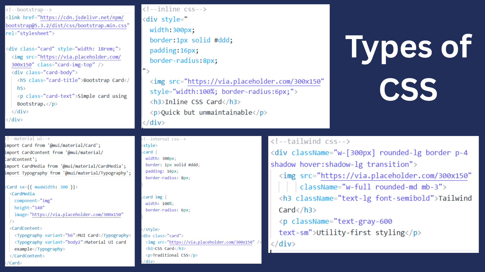

### Audience
- **Frontend Developers** looking for productivity.
- **Full-stack Developers** needing quick, consistent styling.
- **UI Engineers** aiming for design system consistency.

### Scope
- **Tailwind CSS v4:** The latest, zero-config engine.
- **Tailwind CSS v3:** Referencing CLI and CDN-based workflows for legacy comparison.
- **Next.js Integration:** Best practices for modern web apps.

---

## 2. Overview of Tailwind CSS

### Utility-First Philosophy
In Tailwind, you style elements by applying pre-existing classes. Instead of writing a `.card` class in CSS, you use `flex`, `p-4`, `bg-white`, and `shadow-md` directly on the element just like inline css but with shorthand properties or the utilities.

### Atomic Classes & Composition
Tailwind uses **atomic classes**—single-purpose classes that do one thing well. By composing these small pieces, you create complex layouts without the weight of a traditional framework. Each class does exactly one job (one CSS rule), and complex designs are built by combining multiple small utilities instead of writing custom CSS.

### Performance & Scalability
One of Tailwind's biggest strengths is its **Build-time Optimization**.
> [!IMPORTANT]
> **Tiny Production Bundles:** Tailwind scans your template files and only exports the CSS you actually use. Even on massive enterprise sites, the CSS bundle rarely exceeds 10 KB.

---

## 3. Tailwind CSS Versions Overview

### 3.1 Tailwind CSS v3
- **Configuration-driven:** Heavily relies on `tailwind.config.js`.
- **PostCSS Based:** Requires a PostCSS pipeline to process directives like `@tailwind base`.
- **Legacy CDN:** Supported for prototyping but lacks tree-shaking.

### 3.2 Tailwind CSS v4
- **Zero-Config by Default:** Many projects don't even need a config file anymore.
- **Lightning Fast:** Powered by a new Rust-based engine.
- **Native CSS Directives:** Uses standard `@import "tailwindcss";` instead of custom directives `@tailwind base;
@tailwind components; @tailwind utilities;`.
- **Modern Engine:** Better support for CSS variables and container queries.

---

## 4. Environment & Prerequisites

To get started with Tailwind v4 and Next.js, ensure you have:
- **Node.js:** v20.x or higher (recommended).
- **Package Manager:** `npm`, `yarn`, or `pnpm`.
- **Next.js:** v14/v15 for the best compatibility with v4 features.

---

## 5. Project Setup

### 5.1 CDN (Tailwind CSS v3 – Legacy Approach)
The Play CDN is a script you can drop into any HTML file to start using Tailwind classes immediately without a build step.
> [!NOTE]
> **CDN Link:** `<script src="https://cdn.tailwindcss.com"></script>`
> No suggestions will be provided by editors. Use this for testing/trying and not as a choice for production; it's designed for development purposes only.

#### Limitations of CDN Approach
> [!WARNING]
> **Not for Production:** The CDN approach is strictly for prototyping.
- **No Tree-shaking:** It downloads the entire engine to the browser.
- **Large Bundle Size:** Significant performance hit on slow networks.
- **Limited Customization:** Harder to extend themes or use plugins.

#### When CDN is Acceptable
- Rapid Prototyping/Mockups.
- Learning/Playground environments.
- Small internal tools with negligible traffic.

---

### 5.2 Tailwind CLI Setup (v3)
The CLI is the recommended way to use Tailwind for standard static projects or when not using a framework like Next.js.

#### Step-by-Step CLI Implementation:
1. **Folder Structure:** Create two main directories:
   - `src`: For your source code files (CSS).
   - `dist`: For production submission files (Link your `index.html` here).

   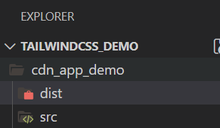

2. **Initialize Node:** Run `npm init -y` (optional) and then use **npx (Node Package Executor)** to initialize Tailwind:
   ```bash
   npx tailwindcss init
   ```
   *This creates a new `tailwind.config.js` file.*

   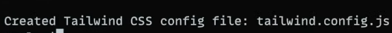

3. **Source CSS:** Create `input.css` in the `src` folder and add the following directives:
   ```css
   @tailwind base;
   @tailwind components;
   @tailwind utilities;
   ```
   > [!TIP]
   > **Linting Issues:** If you see "unknown at-rule" warnings, go to **Settings**, search for **"unknown linting"**, and set it to **Ignore**.

   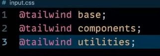

4. **Template HTML:** Create `index.html` inside the `dist` folder.
   ```html
   <div class="bg-slate-900 text-white">Hey!</div>
   ```
   *Note: This will not work yet until we configure the module export.*
   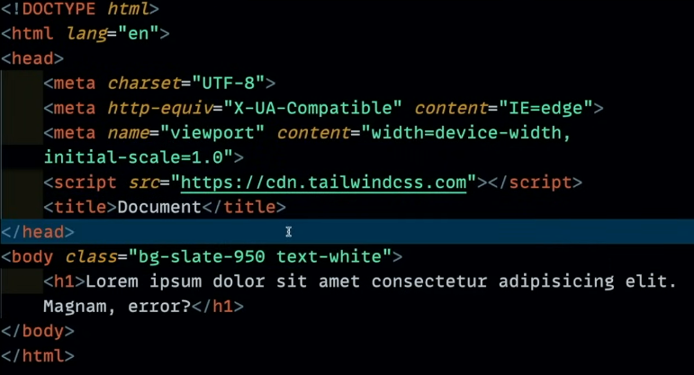
5. **Configure Content:** Open `tailwind.config.js` and update the `content` array:
   ```javascript
   content : ["./dist/index.html"]
   ```
   

6. **Build & Watch:** Link your CSS and start the build process:
   ```bash
   npx tailwindcss -i ./src/input.css -o ./dist/style.css --watch
   ```
   - `-i`: Input file path.
   - `-o`: Output file path.
   - `--watch`: Automatically updates the output CSS when you save changes without needing to reload or rebuild manually.

   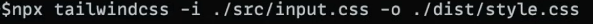
   
   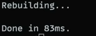

---

### 5.3 Next.js + Tailwind CSS v4 Initialization
To start a new project with Tailwind v4, use the standard Next.js initializer:

```bash
npx create-next-app@latest tailwind-demo-app
```
**Selection Breakdown:**
- **TypeScript:** *Optional* (Recommended for enterprise apps).
- **ESLint/Biome:** *Yes* (For code quality and linting).
- **Tailwind CSS:** *Yes* (Automates plugin installation).
- **App Router:** *Yes* (The modern way to build Next.js apps).
- **Import Alias:** `@/*` (Standard for cleaner imports).

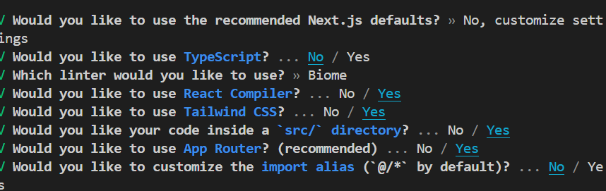

**Selection Breakdown Parameters:**
- **TypeScript:** Adds static typing to JavaScript. Highly recommended for long-term maintainability, as it catches errors during development rather than at runtime. It helps clarify what data structures are being used throughout your app.
- **ESLint:** A linter (like ESLint or Biome) enforces consistent coding standards across the team. It identifies problematic patterns, potential bugs, or code that doesn't adhere to specific style guidelines, ensuring a clean codebase.
- **Tailwind CSS:** Selecting "Yes" tells the initializer to pre-configure Tailwind. It automatically installs the necessary packages, sets up PostCSS, and creates the default CSS file with Tailwind directives, saving you manual configuration time.
- **App Router:** This is the modern Next.js architectural pattern. It supports shared layouts, nested routing, loading states, and error handling out of the box using React Server Components, leading to better performance and SEO.
- **Import Alias:** Configuring an alias (e.g., `@/*`) allows you to import files using absolute paths (like `import { Button } from "@/components/Button"`) instead of messy and error-prone relative paths (like `../../components/Button`).


#### Installing Tailwind CSS v4
In v4, the installation is more streamlined. If you are adding it to an existing project:

```bash
npm install tailwindcss @tailwindcss/postcss postcss
```

#### Global CSS Setup
In your `app/globals.css` (or equivalent), you now only need a single import:

```css
@import "tailwindcss";
```

> [!NOTE]
> Unlike v3, which required `@tailwind base;`, `@tailwind components;`, and `@tailwind utilities;`, v4 uses a standard CSS `@import` which handles everything internally.

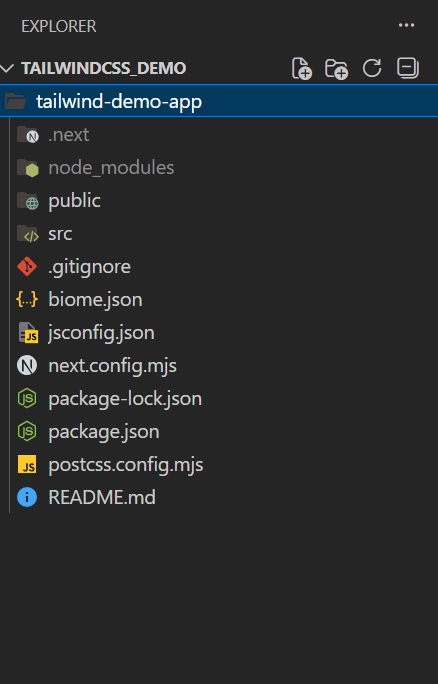

---

## 6. Tailwind CSS Configuration

### 6.1 Why `tailwind.config.js` is Optional in v4
Tailwind v4 is built on a "Convention over Configuration" principle.
- **Zero-config:** Most projects work perfectly with defaults.
- **Native CSS:** You can now handle many customizations directly in your CSS file using the `@theme` block.

### 6.2 When to Create `tailwind.config.js` Manually
You might still need a config file if:
- You are migrating from v3 and have extensive legacy settings.
- You need complex JavaScript-based plugins.
- You want to stick to the familiar JS-based configuration for consistency across teams.

### 6.3 Example Custom Configuration (v3/v4 Hybrid)
```javascript
/** @type {import('tailwindcss').Config} */
module.exports = {
  content: [
    "./app/**/*.{js,ts,jsx,tsx,mdx}",
    "./components/**/*.{js,ts,jsx,tsx,mdx}",
  ],
  theme: {
    extend: {
      colors: {
        brand: "#3b82f6",
      },
    },
  },
  plugins: [],
}
```

---

## 7. PostCSS Usage

### 7.1 PostCSS in Tailwind v3
PostCSS was a mandatory middleman. You needed a `postcss.config.js` to tell the browser how to process the `@tailwind` directives.

### 7.2 PostCSS in Tailwind v4
In v4, Tailwind can act as its own PostCSS plugin, but it's often abstracted away.
- **Auto-detection:** If using the Next.js plugin, it handles the transformation automatically.
- **Optional Config:** You only need `postcss.config.js` if you are using other PostCSS plugins (like `autoprefixer` or `cssnano`).


## 9. File & Folder Structure Explanation

A typical Next.js + Tailwind v4 project follows this structure:

- **`app/`**: Contains Routers and Components.
- **`public/`**: Static assets like images/logos.
- **`globals.css`**: The entry point for Tailwind (@import "tailwindcss").
- **`next.config.js`**: Next.js configuration (often handles Tailwind integration automatically).
- **`tailwind.config.js`**: (Optional) For advanced overrides.

---

## 10. Core Tailwind Concepts

### 10.1 Utility Classes
Tailwind's **utility-first** approach is about building complex components by composing simple, low-level utility classes.

#### The Theme & Customization (v4)
In Tailwind v4, you define your design tokens directly in your CSS using the `@theme` directive. This approach is more native and performant.

```css
@theme {
  --font-family-display: Inter, ui-sans-serif, system-ui;
  --color-primary: #3b82f6;
  --breakpoint-3xl: 1920px;
  --spacing-72: 18rem;
}
```

#### Colors
- **Syntax:** `{property}-{color}-{opacity}` (e.g., `bg-red-500/75`).
- **Palette:** Includes 50+ hand-picked colors across 10 shades, plus flexible opacity modifiers.

**Colors Demo:**

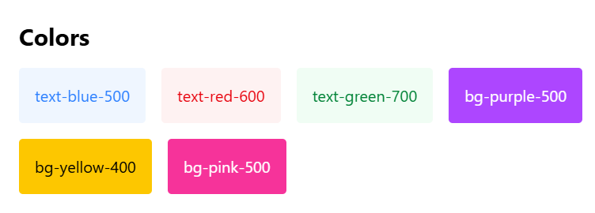

```xml
<section class="bg-white p-6 rounded-lg shadow-md">
            <h2 class="text-2xl font-bold mb-4">Colors</h2>
            <div class="flex gap-4 flex-wrap">
                <div class="text-blue-500 p-4 bg-blue-50 rounded">text-blue-500</div>
                <div class="text-red-600 p-4 bg-red-50 rounded">text-red-600</div>
                <div class="text-green-700 p-4 bg-green-50 rounded">text-green-700</div>
                <div class="bg-purple-500 text-white p-4 rounded">bg-purple-500</div>
                <div class="bg-yellow-400 p-4 rounded">bg-yellow-400</div>
                <div class="bg-pink-500 text-white p-4 rounded">bg-pink-500</div>
            </div>
</section>
```

---

#### Core Utility Categories

##### Spacing
- **Margin (`m-`):** [tailwindcss.com/docs/margin]
- **Padding (`p-`):** [tailwindcss.com/docs/padding]

**Margin Demo (m-, mx-, my-, mt-, etc.):**
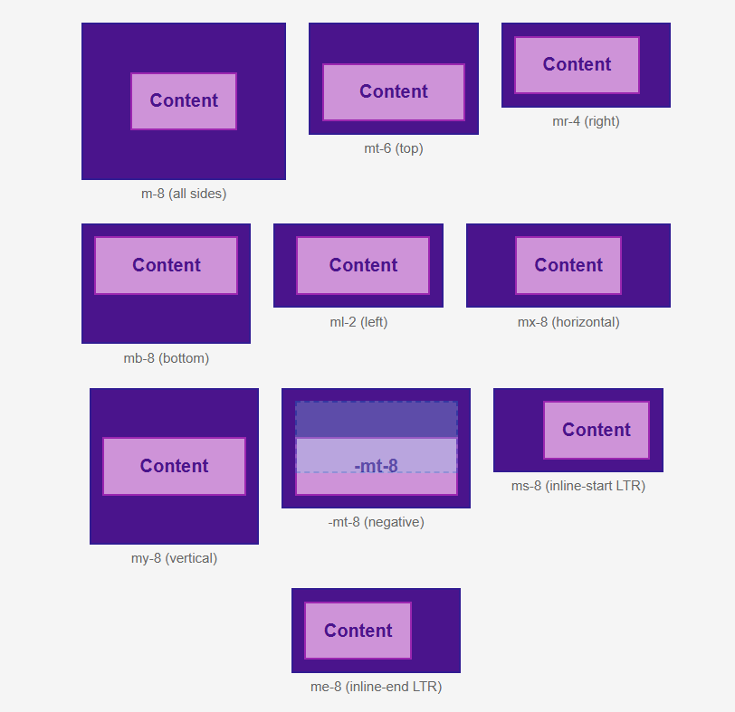
```xml
<div class="flex flex-wrap justify-center gap-5 pt-2">
 <!-- m-8 -->
    <div class="flex flex-col items-center">
      <div class="bg-purple-900 border-2 border-purple-950 p-2 min-w-[150px]">
        <div class="bg-purple-300 text-purple-900 font-bold text-center p-4 border-2 border-purple-600 m-8">
          Content
        </div>
      </div>
      <span class="text-xs text-gray-600 mt-1">m-8 (all sides)</span>
    </div>

    <!-- mt-6 -->
    <div class="flex flex-col items-center">
      <div class="bg-purple-900 border-2 border-purple-950 p-2 min-w-[150px]">
        <div class="bg-purple-300 text-purple-900 font-bold text-center p-4 border-2 border-purple-600 mt-6">
          Content
        </div>
      </div>
      <span class="text-xs text-gray-600 mt-1">mt-6 (top)</span>
    </div>

    <!-- mr-4 -->
    <div class="flex flex-col items-center">
      <div class="bg-purple-900 border-2 border-purple-950 p-2 min-w-[150px]">
        <div class="bg-purple-300 text-purple-900 font-bold text-center p-4 border-2 border-purple-600 mr-4">
          Content
        </div>
      </div>
      <span class="text-xs text-gray-600 mt-1">mr-4 (right)</span>
    </div>

    <!-- mb-8 -->
    <div class="flex flex-col items-center">
      <div class="bg-purple-900 border-2 border-purple-950 p-2 min-w-[150px]">
        <div class="bg-purple-300 text-purple-900 font-bold text-center p-4 border-2 border-purple-600 mb-8">
          Content
        </div>
      </div>
      <span class="text-xs text-gray-600 mt-1">mb-8 (bottom)</span>
    </div>

    <!-- ml-2 -->
    <div class="flex flex-col items-center">
      <div class="bg-purple-900 border-2 border-purple-950 p-2 min-w-[150px]">
        <div class="bg-purple-300 text-purple-900 font-bold text-center p-4 border-2 border-purple-600 ml-2">
          Content
        </div>
      </div>
      <span class="text-xs text-gray-600 mt-1">ml-2 (left)</span>
    </div>

    <!-- mx-8 -->
    <div class="flex flex-col items-center">
      <div class="bg-purple-900 border-2 border-purple-950 p-2 min-w-[150px]">
        <div class="bg-purple-300 text-purple-900 font-bold text-center p-4 border-2 border-purple-600 mx-8">
          Content
        </div>
      </div>
      <span class="text-xs text-gray-600 mt-1">mx-8 (horizontal)</span>
    </div>

    <!-- my-8 -->
    <div class="flex flex-col items-center">
      <div class="bg-purple-900 border-2 border-purple-950 p-2 min-w-[150px]">
        <div class="bg-purple-300 text-purple-900 font-bold text-center p-4 border-2 border-purple-600 my-8">
          Content
        </div>
      </div>
      <span class="text-xs text-gray-600 mt-1">my-8 (vertical)</span>
    </div>

    <!-- Negative margin -->
    <div class="flex flex-col items-center">
      <div class="bg-purple-900 border-2 border-purple-950 p-2 min-w-[150px] relative">
        <div class="h-16 w-36 bg-sky-400 opacity-30 border-2 border-dashed border-sky-600"></div>
        <div class="bg-purple-300 text-purple-900 font-bold text-center p-4 border-2 border-purple-600 -mt-8">
          -mt-8
        </div>
      </div>
      <span class="text-xs text-gray-600 mt-1">-mt-8 (negative)</span>
    </div>

    <!-- ms-8 -->
    <div class="flex flex-col items-center">
      <div class="bg-purple-900 border-2 border-purple-950 p-2 min-w-[150px]">
        <div class="bg-purple-300 text-purple-900 font-bold text-center p-4 border-2 border-purple-600 ms-8">
          Content
        </div>
      </div>
      <span class="text-xs text-gray-600 mt-1">ms-8 (inline-start)</span>
    </div>

    <!-- me-8 -->
    <div class="flex flex-col items-center">
      <div class="bg-purple-900 border-2 border-purple-950 p-2 min-w-[150px]">
        <div class="bg-purple-300 text-purple-900 font-bold text-center p-4 border-2 border-purple-600 me-8">
          Content
        </div>
      </div>
      <span class="text-xs text-gray-600 mt-1">me-8 (inline-end)</span>
    </div>
 </div>
```

**Padding Demo (p-, px-, py-, pt-, etc.):**
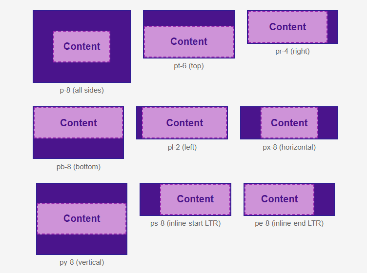
```xml
 <div class="flex flex-wrap justify-center gap-5">

    <!-- p-8 -->
    <div class="flex flex-col items-center">
      <div class="bg-purple-900 border-2 border-purple-950 min-w-[150px] p-8">
        <div class="bg-purple-300 text-purple-900 font-bold text-center p-4 border-2 border-dashed border-purple-600">
          Content
        </div>
      </div>
      <span class="text-xs text-gray-600 mt-1">p-8 (all sides)</span>
    </div>

    <!-- pt-6 -->
    <div class="flex flex-col items-center">
      <div class="bg-purple-900 border-2 border-purple-950 min-w-[150px] pt-6">
        <div class="bg-purple-300 text-purple-900 font-bold text-center p-4 border-2 border-dashed border-purple-600">
          Content
        </div>
      </div>
      <span class="text-xs text-gray-600 mt-1">pt-6 (top)</span>
    </div>

    <!-- pr-4 -->
    <div class="flex flex-col items-center">
      <div class="bg-purple-900 border-2 border-purple-950 min-w-[150px] pr-4">
        <div class="bg-purple-300 text-purple-900 font-bold text-center p-4 border-2 border-dashed border-purple-600">
          Content
        </div>
      </div>
      <span class="text-xs text-gray-600 mt-1">pr-4 (right)</span>
    </div>

    <!-- pb-8 -->
    <div class="flex flex-col items-center">
      <div class="bg-purple-900 border-2 border-purple-950 min-w-[150px] pb-8">
        <div class="bg-purple-300 text-purple-900 font-bold text-center p-4 border-2 border-dashed border-purple-600">
          Content
        </div>
      </div>
      <span class="text-xs text-gray-600 mt-1">pb-8 (bottom)</span>
    </div>

    <!-- pl-2 -->
    <div class="flex flex-col items-center">
      <div class="bg-purple-900 border-2 border-purple-950 min-w-[150px] pl-2">
        <div class="bg-purple-300 text-purple-900 font-bold text-center p-4 border-2 border-dashed border-purple-600">
          Content
        </div>
      </div>
      <span class="text-xs text-gray-600 mt-1">pl-2 (left)</span>
    </div>

    <!-- px-8 -->
    <div class="flex flex-col items-center">
      <div class="bg-purple-900 border-2 border-purple-950 min-w-[150px] px-8">
        <div class="bg-purple-300 text-purple-900 font-bold text-center p-4 border-2 border-dashed border-purple-600">
          Content
        </div>
      </div>
      <span class="text-xs text-gray-600 mt-1">px-8 (horizontal)</span>
    </div>

    <!-- py-8 -->
    <div class="flex flex-col items-center">
      <div class="bg-purple-900 border-2 border-purple-950 min-w-[150px] py-8">
        <div class="bg-purple-300 text-purple-900 font-bold text-center p-4 border-2 border-dashed border-purple-600">
          Content
        </div>
      </div>
      <span class="text-xs text-gray-600 mt-1">py-8 (vertical)</span>
    </div>

    <!-- ps-8 -->
    <div class="flex flex-col items-center">
      <div class="bg-purple-900 border-2 border-purple-950 min-w-[150px] ps-8">
        <div class="bg-purple-300 text-purple-900 font-bold text-center p-4 border-2 border-dashed border-purple-600">
          Content
        </div>
      </div>
      <span class="text-xs text-gray-600 mt-1">ps-8 (inline-start)</span>
    </div>

    <!-- pe-8 -->
    <div class="flex flex-col items-center">
      <div class="bg-purple-900 border-2 border-purple-950 min-w-[150px] pe-8">
        <div class="bg-purple-300 text-purple-900 font-bold text-center p-4 border-2 border-dashed border-purple-600">
          Content
        </div>
      </div>
      <span class="text-xs text-gray-600 mt-1">pe-8 (inline-end)</span>
    </div>
  </div>
```

##### Sizing (w-, h-, max-w-, min-h-)
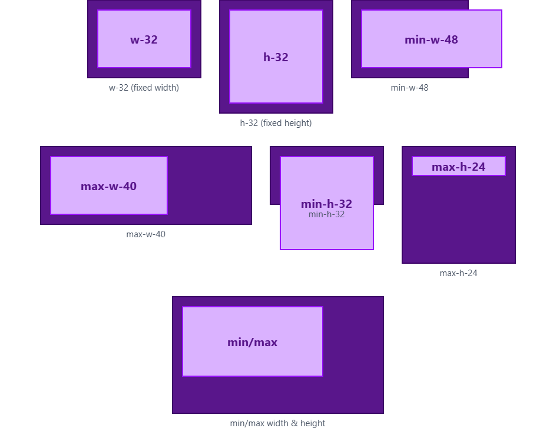
**Sizing Demo:**
```xml


  <div class="flex flex-wrap justify-center gap-6">

    <!-- w-32 -->
    <div class="flex flex-col items-center">
      <div class="bg-purple-900 border-2 border-purple-950 p-3">
        <div class="bg-purple-300 text-purple-900 font-bold text-center h-20 w-32 flex items-center justify-center border-2 border-purple-600">
          w-32
        </div>
      </div>
      <span class="text-xs text-gray-600 mt-1">w-32 (fixed width)</span>
    </div>

    <!-- h-32 -->
    <div class="flex flex-col items-center">
      <div class="bg-purple-900 border-2 border-purple-950 p-3">
        <div class="bg-purple-300 text-purple-900 font-bold text-center w-32 h-32 flex items-center justify-center border-2 border-purple-600">
          h-32
        </div>
      </div>
      <span class="text-xs text-gray-600 mt-1">h-32 (fixed height)</span>
    </div>

    <!-- min-w-48 -->
    <div class="flex flex-col items-center">
      <div class="bg-purple-900 border-2 border-purple-950 p-3 w-40">
        <div class="bg-purple-300 text-purple-900 font-bold text-center min-w-48 h-20 flex items-center justify-center border-2 border-purple-600">
          min-w-48
        </div>
      </div>
      <span class="text-xs text-gray-600 mt-1">min-w-48</span>
    </div>

    <!-- max-w-40 -->
    <div class="flex flex-col items-center">
      <div class="bg-purple-900 border-2 border-purple-950 p-3 w-72">
        <div class="bg-purple-300 text-purple-900 font-bold text-center max-w-40 h-20 flex items-center justify-center border-2 border-purple-600">
          max-w-40
        </div>
      </div>
      <span class="text-xs text-gray-600 mt-1">max-w-40</span>
    </div>

    <!-- min-h-32 -->
    <div class="flex flex-col items-center">
      <div class="bg-purple-900 border-2 border-purple-950 p-3 h-20">
        <div class="bg-purple-300 text-purple-900 font-bold text-center min-h-32 w-32 flex items-center justify-center border-2 border-purple-600">
          min-h-32
        </div>
      </div>
      <span class="text-xs text-gray-600 mt-1">min-h-32</span>
    </div>

    <!-- max-h-24 -->
    <div class="flex flex-col items-center">
      <div class="bg-purple-900 border-2 border-purple-950 p-3 h-40">
        <div class="bg-purple-300 text-purple-900 font-bold text-center max-h-24 w-32 overflow-hidden flex items-center justify-center border-2 border-purple-600">
          max-h-24
        </div>
      </div>
      <span class="text-xs text-gray-600 mt-1">max-h-24</span>
    </div>

    <!-- Combined constraints -->
    <div class="flex flex-col items-center">
      <div class="bg-purple-900 border-2 border-purple-950 p-3 w-72 h-40">
        <div class="bg-purple-300 text-purple-900 font-bold text-center 
                    min-w-32 max-w-48 min-h-24 max-h-32 
                    flex items-center justify-center border-2 border-purple-600">
          min/max
        </div>
      </div>
      <span class="text-xs text-gray-600 mt-1">
        min/max width & height
      </span>
    </div>

  </div>

```

##### Typography
- **Reference:** [tailwindcss.com/docs/font-size], [tailwindcss.com/docs/font-weight], [tailwindcss.com/docs/font-family]

**Typography Demo:**
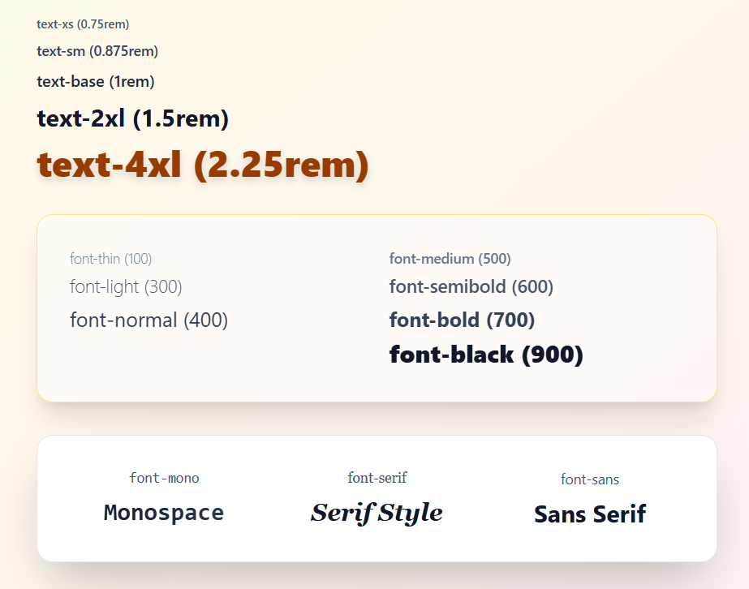
```xml
<div class="p-12 max-w-4xl mx-auto space-y-8 bg-gradient-to-br from-amber-50 via-orange-50 to-rose-50">
  <!-- Font sizes -->
  <div class="space-y-2">
    <p class="text-xs font-medium text-slate-600">text-xs (0.75rem)</p>
    <p class="text-sm font-medium text-slate-700">text-sm (0.875rem)</p>
    <p class="text-base font-semibold text-slate-800">text-base (1rem)</p>
    <p class="text-2xl font-bold text-slate-900">text-2xl (1.5rem)</p>
    <p class="text-4xl font-black text-amber-800 drop-shadow-lg">text-4xl (2.25rem)</p>
  </div>
  
  <!-- Font weights -->
  <div class="grid grid-cols-2 gap-6 p-8 bg-white/50 backdrop-blur-sm rounded-2xl shadow-xl border border-amber-200">
    <div>
      <p class="text-sm font-thin text-slate-500 mb-1">font-thin (100)</p>
      <p class="text-lg font-light text-slate-600 mb-1">font-light (300)</p>
      <p class="text-xl font-normal text-slate-700 mb-1">font-normal (400)</p>
    </div>
    <div>
      <p class="text-sm font-medium text-slate-500 mb-1">font-medium (500)</p>
      <p class="text-lg font-semibold text-slate-600 mb-1">font-semibold (600)</p>
      <p class="text-xl font-bold text-slate-700 mb-1">font-bold (700)</p>
      <p class="text-2xl font-black text-slate-900">font-black (900)</p>
    </div>
  </div>
  
  <!-- Font families -->
  <div class="grid grid-cols-3 gap-6 p-8 bg-white rounded-2xl shadow-2xl border border-slate-200">
    <div class="text-center">
      <p class="text-sm font-mono text-slate-600 mb-2">font-mono</p>
      <p class="text-2xl font-mono font-bold bg-gradient-to-r from-slate-900 to-slate-700 bg-clip-text text-transparent">Monospace</p>
    </div>
    <div class="text-center">
      <p class="text-sm font-serif text-slate-600 mb-2">font-serif</p>
      <p class="text-2xl font-serif font-black italic text-slate-900">Serif Style</p>
    </div>
    <div class="text-center">
      <p class="text-sm font-sans text-slate-600 mb-2">font-sans</p>
      <p class="text-2xl font-sans font-bold text-slate-900">Sans Serif</p>
    </div>
  </div>
</div>
```

##### Layouts (flex, grid, absolute, etc.)
**Flexbox Demo:**

https://github.com/user-attachments/assets/9744f3da-08e8-4a85-b840-da93622640c8

```xml

  <div class="space-y-10">

    <!-- Flex Row -->
    <div>
      <p class="text-sm text-gray-700 mb-2">flex-row + gap-4</p>
      <div class="flex gap-4 bg-purple-900 p-4">
        <div class="bg-purple-300 p-4 font-bold">1</div>
        <div class="bg-purple-300 p-4 font-bold">2</div>
        <div class="bg-purple-300 p-4 font-bold">3</div>
      </div>
    </div>

    <!-- Justify Content -->
    <div>
      <p class="text-sm text-gray-700 mb-2">justify-between</p>
      <div class="flex justify-between bg-purple-900 p-4">
        <div class="bg-purple-300 p-4">A</div>
        <div class="bg-purple-300 p-4">B</div>
        <div class="bg-purple-300 p-4">C</div>
      </div>
    </div>

    <!-- Align Items -->
    <div>
      <p class="text-sm text-gray-700 mb-2">items-center (vertical alignment)</p>
      <div class="flex items-center bg-purple-900 p-4 h-32 gap-4">
        <div class="bg-purple-300 p-4 h-12">Short</div>
        <div class="bg-purple-300 p-4 h-20">Tall</div>
      </div>
    </div>

    <!-- Flex Wrap -->
    <div>
      <p class="text-sm text-gray-700 mb-2">flex-wrap</p>
      <div class="flex flex-wrap bg-purple-900 p-4 gap-4 w-72">
        <div class="bg-purple-300 p-4 w-32">Item</div>
        <div class="bg-purple-300 p-4 w-32">Item</div>
        <div class="bg-purple-300 p-4 w-32">Item</div>
      </div>
    </div>

    <!-- Flex Grow -->
    <div>
      <p class="text-sm text-gray-700 mb-2">flex-grow</p>
      <div class="flex bg-purple-900 p-4 gap-4">
        <div class="bg-purple-300 p-4">Normal</div>
        <div class="bg-purple-300 p-4 flex-grow text-center">flex-grow</div>
      </div>
    </div>

    <!-- Self Alignment -->
    <div>
      <p class="text-sm text-gray-700 mb-2">self-end</p>
      <div class="flex items-start bg-purple-900 p-4 h-32 gap-4">
        <div class="bg-purple-300 p-4">Default</div>
        <div class="bg-purple-300 p-4 self-end">self-end</div>
      </div>
    </div>

  </div>
```

**Grid Demo:**

https://github.com/user-attachments/assets/b5ca1ef2-0838-4fd0-9b6c-c19bda82f889

```xml

  <div class="space-y-10">

    <!-- Basic Grid -->
    <div>
      <p class="text-sm text-gray-700 mb-2">grid-cols-3</p>
      <div class="grid grid-cols-3 gap-4 bg-purple-900 p-4">
        <div class="bg-purple-300 p-4">1</div>
        <div class="bg-purple-300 p-4">2</div>
        <div class="bg-purple-300 p-4">3</div>
      </div>
    </div>

    <!-- Column Span -->
    <div>
      <p class="text-sm text-gray-700 mb-2">col-span-2</p>
      <div class="grid grid-cols-3 gap-4 bg-purple-900 p-4">
        <div class="bg-purple-300 p-4 col-span-2">col-span-2</div>
        <div class="bg-purple-300 p-4">Item</div>
      </div>
    </div>

    <!-- Row Span -->
    <div>
      <p class="text-sm text-gray-700 mb-2">row-span-2</p>
      <div class="grid grid-cols-3 grid-rows-2 gap-4 bg-purple-900 p-4">
        <div class="bg-purple-300 p-4 row-span-2">row-span-2</div>
        <div class="bg-purple-300 p-4">Item</div>
        <div class="bg-purple-300 p-4">Item</div>
      </div>
    </div>

    <!-- Place Items -->
    <div>
      <p class="text-sm text-gray-700 mb-2">place-items-center</p>
      <div class="grid grid-cols-3 gap-4 place-items-center bg-purple-900 p-4 h-32">
        <div class="bg-purple-300 p-4">A</div>
        <div class="bg-purple-300 p-4">B</div>
        <div class="bg-purple-300 p-4">C</div>
      </div>
    </div>

    <!-- Responsive Grid -->
    <div>
      <p class="text-sm text-gray-700 mb-2">Responsive grid</p>
      <div class="grid grid-cols-1 sm:grid-cols-2 md:grid-cols-4 gap-4 bg-purple-900 p-4">
        <div class="bg-purple-300 p-4">1</div>
        <div class="bg-purple-300 p-4">2</div>
        <div class="bg-purple-300 p-4">3</div>
        <div class="bg-purple-300 p-4">4</div>
      </div>
    </div>
  </div>
```

**Borders & Shadows Demo:**

https://github.com/user-attachments/assets/e4de2998-3a8b-418d-9f72-0d1d9860d9bd

```xml
<div class="p-12 space-y-6 bg-gradient-to-br from-rose-50 to-orange-50">
  <div class="grid grid-cols-2 md:grid-cols-4 gap-6 max-w-4xl mx-auto">
    <!-- Borders -->
    <div class="border border-slate-300 p-6 rounded-xl shadow-sm hover:shadow-md transition-shadow">border (1px)</div>
    <div class="border-4 border-indigo-400 p-6 rounded-2xl shadow-lg hover:shadow-xl transition-all hover:scale-105 bg-indigo-50">border-4</div>
    <div class="border-l-8 border-green-500 p-6 rounded-xl shadow-md bg-gradient-to-r from-green-50 to-emerald-50">border-l-8</div>
    
    <!-- Shadows -->
    <div class="p-8 rounded-2xl shadow-sm hover:shadow-lg transition-shadow bg-white border">shadow-sm</div>
    <div class="p-8 rounded-2xl shadow-md hover:shadow-2xl transition-all duration-300 hover:-translate-y-1 bg-gradient-to-r from-slate-100 to-slate-200 border">shadow-md</div>
    <div class="p-8 rounded-3xl shadow-xl hover:shadow-3xl bg-gradient-to-br from-purple-500 to-pink-500 text-white font-bold shadow-inner hover:shadow-none transition-all duration-500 hover:rotate-6">shadow-xl</div>
  </div>
</div>
```

##### Backgrounds
- **References:** [tailwindcss.com/docs/background-attachment], [tailwindcss.com/docs/background-clip], etc.

**Complete Backgrounds Demo:**

https://github.com/user-attachments/assets/d84d4056-2f1a-41d9-bbf5-a53760dbf4fe

```xml


  <div class="grid grid-cols-1 sm:grid-cols-2 lg:grid-cols-3 gap-6">

    <!-- background-color -->
    <div class="bg-purple-300 border-2 border-purple-700 p-6 text-center font-semibold text-purple-900">
      background-color
      <div class="text-xs text-gray-700 mt-2">bg-purple-300</div>
    </div>

    <!-- background-image -->
    <div class="bg-[url('https://picsum.photos/300')] border-2 border-purple-700 p-6 text-center font-semibold text-white">
      background-image
      <div class="text-xs mt-2">bg-[url(...)]</div>
    </div>

    <!-- background-repeat -->
    <div class="bg-[url('https://www.transparenttextures.com/patterns/asfalt-dark.png')] 
                bg-repeat border-2 border-purple-700 p-6 text-center font-semibold text-white">
      background-repeat
      <div class="text-xs mt-2">bg-repeat</div>
    </div>

    <!-- background-no-repeat -->
    <div class="bg-[url('https://picsum.photos/200')] 
                bg-no-repeat border-2 border-purple-700 p-6 text-center font-semibold text-white">
      background-no-repeat
      <div class="text-xs mt-2">bg-no-repeat</div>
    </div>

    <!-- background-position -->
    <div class="bg-[url('https://picsum.photos/300')] 
                bg-no-repeat bg-bottom border-2 border-purple-700 p-6 h-40 text-center font-semibold text-white">
      background-position
      <div class="text-xs mt-2">bg-bottom</div>
    </div>

    <!-- background-size: cover -->
    <div class="bg-[url('https://picsum.photos/600')] 
                bg-cover bg-center border-2 border-purple-700 p-6 h-40 text-center font-semibold text-white">
      background-size: cover
      <div class="text-xs mt-2">bg-cover</div>
    </div>

    <!-- background-size: contain -->
    <div class="bg-[url('https://picsum.photos/200')] 
                bg-contain bg-no-repeat bg-center border-2 border-purple-700 p-6 h-40 text-center font-semibold text-white">
      background-size: contain
      <div class="text-xs mt-2">bg-contain</div>
    </div>

    <!-- background-attachment: fixed -->
    <div class="bg-[url('https://picsum.photos/600')] 
                bg-fixed bg-cover bg-center border-2 border-purple-700 p-6 h-40 text-center font-semibold text-white">
      background-attachment
      <div class="text-xs mt-2">bg-fixed</div>
    </div>

    <!-- background-clip -->
    <div class="bg-purple-300 bg-clip-content p-6 border-8 border-dashed border-purple-700 text-center font-semibold text-purple-900">
      background-clip
      <div class="text-xs mt-2">bg-clip-content</div>
    </div>

    <!-- background-origin -->
    <div class="bg-[url('https://picsum.photos/300')] 
                bg-origin-content bg-no-repeat bg-center 
                p-6 border-8 border-purple-700 text-center font-semibold text-white">
      background-origin
      <div class="text-xs mt-2">bg-origin-content</div>
    </div>

  </div>

  <!-- Scroll section for bg-fixed -->
  <div class="h-[600px]"></div>
```

---

### 10.2 Responsive Design
- **Reference:** [tailwindcss.com/docs/responsive-design]

Tailwind adopts a mobile-first breakpoint system with intuitive prefixes.

**Breakpoint Scale:**
- **Default:** < 640px (mobile)
- **`sm:`**: ≥ 640px (tablet)
- **`md:`**: ≥ 768px (laptop)
- **`lg:`**: ≥ 1024px (desktop)
- **`xl:`**: ≥ 1280px (wide)
- **`2xl:`**: ≥ 1536px (ultra-wide)

**Responsive Demo:**

https://github.com/user-attachments/assets/5af57439-a75b-47a0-b854-08be933fe8d6

```xml

    <div
      class="
        w-full h-64 rounded-xl flex items-center justify-center
        text-white font-bold text-xl transition-all duration-300

        bg-gray-800
        sm:bg-blue-500
        md:bg-green-500
        lg:bg-yellow-500
        xl:bg-purple-500
        2xl:bg-red-500

        max-sm:bg-gray-700
        max-md:bg-blue-700
        max-lg:bg-green-700
        max-xl:bg-yellow-700
        max-2xl:bg-purple-700
      "
    >
      <span class="block text-center">
        Resize Screen
      </span>
    </div>

    <!-- Legend -->
    <div class="mt-8 grid grid-cols-2 sm:grid-cols-3 lg:grid-cols-6 gap-4 text-sm">

      <div class="flex items-center gap-2">
        <span class="w-4 h-4 bg-gray-800 rounded"></span>
        <span>Base (default)</span>
      </div>

      <div class="flex items-center gap-2">
        <span class="w-4 h-4 bg-blue-500 rounded"></span>
        <span>sm ≥ 640px</span>
      </div>

      <div class="flex items-center gap-2">
        <span class="w-4 h-4 bg-green-500 rounded"></span>
        <span>md ≥ 768px</span>
      </div>

      <div class="flex items-center gap-2">
        <span class="w-4 h-4 bg-yellow-500 rounded"></span>
        <span>lg ≥ 1024px</span>
      </div>

      <div class="flex items-center gap-2">
        <span class="w-4 h-4 bg-purple-500 rounded"></span>
        <span>xl ≥ 1280px</span>
      </div>

      <div class="flex items-center gap-2">
        <span class="w-4 h-4 bg-red-500 rounded"></span>
        <span>2xl ≥ 1536px</span>
      </div>

    </div>

    <!-- Max-width Explanation -->
    <div class="mt-10 text-sm text-gray-600 text-center">
      <p>
        <strong>max-*</strong> utilities apply styles
        <strong>up to</strong> a breakpoint (upper bound).
      </p>
      <p class="mt-2">
        Example: <code class="bg-gray-200 px-2 py-1 rounded">max-md:</code>
        applies when screen width is <strong>below md</strong>.
      </p>
    </div>

  </div>
```

---

### 10.3 State Variants
- **Reference:** [tailwindcss.com/docs/hover-focus-and-other-states]

**Pseudo-class Variants:**
- **`hover:`** → `:hover` state
- **`focus:`** → `:focus` state  
- **`active:`** → `:active` state
- **`disabled:`** → `:disabled` state

**Group & Peer Modifiers:**
- **`group-*`:** Child responds to parent state.
- **`peer-*`:** Sibling responds to previous sibling state.

**State Variants Demo:**

https://github.com/user-attachments/assets/fe74e21a-fc50-4451-a71f-ddfd860bb8b4

```xml

  <div class="max-w-5xl mx-auto space-y-12">

    <!-- Hover / Focus / Active -->
    <section>
      <h2 class="font-semibold mb-3 text-purple-800">Hover • Focus • Active</h2>
      <div class="flex gap-4">
        <button
          class="px-6 py-3 bg-purple-300 text-purple-900 font-semibold rounded
                 hover:bg-purple-500 hover:text-white
                 focus:outline-none focus:ring-4 focus:ring-purple-400
                 active:bg-purple-700 transition">
          Interact Me
        </button>

        <input
          type="text"
          placeholder="Focus me"
          class="px-4 py-3 border-2 border-purple-300 rounded
                 focus:border-purple-600 focus:ring-2 focus:ring-purple-300"
        />
      </div>
    </section>

    <!-- First / Last -->
    <section>
      <h2 class="font-semibold mb-3 text-purple-800">First • Last</h2>
      <ul class="flex gap-3">
        <li class="px-4 py-2 bg-purple-200 first:bg-purple-600 first:text-white rounded">
          First
        </li>
        <li class="px-4 py-2 bg-purple-200 rounded">Middle</li>
        <li class="px-4 py-2 bg-purple-200 last:bg-purple-600 last:text-white rounded">
          Last
        </li>
      </ul>
    </section>

    <!-- Odd / Even -->
    <section>
      <h2 class="font-semibold mb-3 text-purple-800">Odd • Even</h2>
      <ul class="divide-y border rounded overflow-hidden">
        <li class="p-3 odd:bg-purple-100 even:bg-purple-300">Row 1</li>
        <li class="p-3 odd:bg-purple-100 even:bg-purple-300">Row 2</li>
        <li class="p-3 odd:bg-purple-100 even:bg-purple-300">Row 3</li>
        <li class="p-3 odd:bg-purple-100 even:bg-purple-300">Row 4</li>
      </ul>
    </section>

    <!-- Required / Invalid -->
    <section>
      <h2 class="font-semibold mb-3 text-purple-800">Required • Invalid</h2>
      <div class="flex gap-4">
        <input
          type="text"
          required
          placeholder="Required field"
          class="px-4 py-3 border-2 rounded
                 required:border-purple-600"
        />

        <input
          type="email"
          placeholder="Invalid email"
          value="wrong-email"
          class="px-4 py-3 border-2 rounded
                 invalid:border-red-600 invalid:bg-red-50"
        />
      </div>
    </section>

    <!-- Disabled -->
    <section>
      <h2 class="font-semibold mb-3 text-purple-800">Disabled</h2>
      <button
        disabled
        class="px-6 py-3 bg-purple-300 text-purple-900 font-semibold rounded
               disabled:bg-gray-300 disabled:text-gray-500 disabled:cursor-not-allowed">
        Disabled Button
      </button>
    </section>

    <!-- Nth-child via odd/even + group -->
    <section>
      <h2 class="font-semibold mb-3 text-purple-800">Nth-child (Odd / Even Simulation)</h2>
      <ul class="group border rounded overflow-hidden">
        <li class="p-3 odd:bg-purple-200 even:bg-purple-400 group-hover:text-white">
          Item 1
        </li>
        <li class="p-3 odd:bg-purple-200 even:bg-purple-400 group-hover:text-white">
          Item 2
        </li>
        <li class="p-3 odd:bg-purple-200 even:bg-purple-400 group-hover:text-white">
          Item 3
        </li>
        <li class="p-3 odd:bg-purple-200 even:bg-purple-400 group-hover:text-white">
          Item 4
        </li>
      </ul>
    </section>

  </div>
```

---

### 10.4 Dark Mode
- **Reference:** [tailwindcss.com/docs/dark-mode]

Tailwind supports two dark mode strategies: media (system preference) and class (manual toggle).

**Dark Mode Demo (Full Page Implementation):**


https://github.com/user-attachments/assets/e4fee6c6-3dae-444e-b6c7-479d15eef728


```xml
<!DOCTYPE html>
<html lang="en" class="light">
<head>
  <meta charset="UTF-8" />
  <meta name="viewport" content="width=device-width, initial-scale=1.0"/>
  <title>Tailwind Light / Dark Mode Toggle</title>

  <!-- Tailwind CDN -->
  <script src="https://cdn.tailwindcss.com"></script>

  <!-- Enable class-based dark mode -->
  <script>
    tailwind.config = {
      darkMode: 'class'
    }
  </script>
</head>

<body class="bg-gray-100 text-gray-900 dark:bg-gray-900 dark:text-gray-100 transition-colors duration-300">

  <div class="min-h-screen flex flex-col items-center justify-center gap-8">

    <!-- Toggle Button -->
    <button
      id="themeToggle"
      class="px-6 py-3 rounded-lg font-semibold
             bg-purple-700 text-white
             dark:bg-yellow-400 dark:text-gray-900
             transition-all duration-300">
      🌙 Switch to Dark Mode
    </button>

    <!-- Demo Card -->
    <div class="w-80 rounded-xl p-6 shadow-lg
                bg-white text-gray-800
                dark:bg-gray-800 dark:text-gray-100
                transition-colors duration-300">

      <h2 class="text-xl font-bold mb-2">
        Tailwind Dark Mode
      </h2>

      <p class="text-sm">
        This card changes styles based on the current theme using
        <code class="font-mono bg-gray-200 px-1 rounded dark:bg-gray-700">
          dark:
        </code>
        variants.
      </p>

      <div class="mt-4 p-3 rounded
                  bg-gray-100 dark:bg-gray-700">
        Theme-aware container
      </div>
    </div>

  </div>

  <!-- Toggle Script -->
  <script>
    const html = document.documentElement;
    const toggleBtn = document.getElementById('themeToggle');

    toggleBtn.addEventListener('click', () => {
      html.classList.toggle('dark');

      toggleBtn.textContent = html.classList.contains('dark')
        ? '☀️ Switch to Light Mode'
        : '🌙 Switch to Dark Mode';
    });
  </script>

</body>
</html>

```

**Configuration Options:**
```javascript
// tailwind.config.js
darkMode: 'media',    // System preference
darkMode: 'class',    // Manual toggle (.dark class)
darkMode: ['class'],  // Custom selector
darkMode: 'selector'  // v4 native
```

**Stacked Variants Example:**
- `dark:group-hover:bg-slate-800`
- `focus:dark:ring-blue-500/50`
- `md:hover:focus-visible:scale-105`


---

## 11. Best Practices

### Component Extraction
Don't repeat yourself. If you are using the same 10 classes for every button, extract them into a reusable React component or use `@apply`.

### Avoiding Class Bloating
If an element has too many classes, it can become hard to read. Break down your components into smaller pieces or use conditional logic for state management.

### Using `@apply` Sparingly
`@apply` allows you to use Tailwind classes inside your CSS. While useful, overusing it defeats the purpose of utility-first CSS and makes styles harder to track.

### Design Token Consistency
Always use the theme's spacing and color values (`p-4`, `text-blue-500`) instead of hardcoded magic numbers (`p-[17px]`, `text-[#3b82f6]`).

---

## 12. Performance & Optimization

### Tree-Shaking
Tailwind's compiler automatically removes any class not found in your source code. This results in the smallest possible production CSS.

### JIT Compilation (Just-In-Time)
Enabled by default since v3, JIT generates styles on demand as you author your templates. This allows for arbitrary values like `top-[117px]`.

### Build Size Reduction
By using Tailwind, you avoid the "Dead CSS" problem. The size of your CSS file remains constant even as your project grows significantly.

---

## 13. Demo Implementation

### 13.1 Objective
Show a real-world implementation of a **Responsive Card List**.
- **Mobile:** Image on top, text below.
- **Desktop:** Image on left, text on right.
- **Features:** Hover effects, dark mode support, and focus states.

### 13.2 Code Snippets

[](./assets/demo.mp4)

#### `components/FeatureCard.tsx`
```xml
"use client";

import Image from "next/image";
//contents of the page.tsx file
const hotels = [
  {
    id: 1,
    name: "Grand Palace Hotel",
    location: "Mumbai, India",
    price: "₹8,500 / night",
    image: "/hotel1.jpg",
    description:
      "Luxury stay with sea-facing rooms, free breakfast, and rooftop pool."
  },
  {
    id: 2,
    name: "Mountain View Resort",
    location: "Manali, India",
    price: "₹6,200 / night",
    image: "/hotel2.jpg",
    description:
      "Peaceful mountain retreat with scenic views and cozy wooden interiors."
  },
  {
    id: 3,
    name: "City Central Inn",
    location: "Bangalore, India",
    price: "₹4,800 / night",
    image: "/hotel3.jpg",
    description:
      "Comfortable business hotel located near major IT parks."
  }
];

export default function HomePage() {
  return (
    <main className="min-h-screen bg-gray-100">

      {/* Header */}
      <header className="flex items-center justify-between px-6 py-4 max-w-6xl mx-auto">
        <h1 className="text-2xl font-bold text-gray-900">
          Hotel Listings
        </h1>
      </header>

      {/* Cards Section */}
      <section className="max-w-6xl mx-auto px-6 pb-12 space-y-6">
        {hotels.map((hotel) => (
          <article
            key={hotel.id}
            tabIndex={0}
            className="flex flex-col md:flex-row overflow-hidden rounded-xl border border-gray-200 bg-white hover:shadow-lg transition-shadow duration-300 focus-within:ring-2 focust-within:ring-purple-500"
          >
            {/* Image */}
            <Image
              src={hotel.image}
              alt={hotel.name}
              width={256}
              height={224}
              className="h-56 w-full md:h-auto md:w-64 object-cover"
            />

            {/* Content */}
            <div className="flex flex-col justify-between p-5 flex-1">
              <div>
                <h2 className="text-xl font-semibold text-gray-900">
                  {hotel.name}
                </h2>

                <p className="text-sm text-gray-600 mt-1">
                  {hotel.location}
                </p>

                <p className="text-gray-700 mt-3">
                  {hotel.description}
                </p>
              </div>

              {/* Footer */}
              <div className="flex items-center justify-between mt-4">
                <span className="text-lg font-bold text-purple-700">
                  {hotel.price}
                </span>

                <button
                  className="rounded-lg px-4 py-2 text-sm font-medium bg-purple-600 text-white hover:bg-purple-700 focus:outline-none focus:ring-2 focus:ring-purple-400"
                >
                  Book Now
                </button>
              </div>
            </div>
          </article>
        ))}
      </section>
    </main>
  );
}

```

#### `app/globals.css` (Tailwind v4)
```css
@import "tailwindcss";

/* Optional custom theme variables */
@theme {
  --color-brand-blue: #0ea5e9;
  --font-display: "Outfit", sans-serif;
}
```

#### Styling Explanation
1. **Responsive Layout:** `flex-col` for mobile and `md:flex-row` for screens larger than 768px.
2. **Hover Effects:** `group-hover:scale-110` targets the image when the parent card is hovered.
3. **Dark Mode:** `dark:bg-slate-800` and `dark:text-white` automatically adjust based on theme.
4. **Transition/Active:** `transition-all duration-300` ensures smooth scaling, while `active:bg-blue-800` gives tactile feedback on click.
5. **Accessibility:** `focus-within:ring-2` highlights the entire card when a keyboard user tabs into the button.

---

## 14. Common Issues & Troubleshooting

### Styles Not Applying
- **Check Content Paths:** Ensure your `tailwind.config.js` or v4 engine is scanning the correct files.
- **Directives:** In v4, ensure `@import "tailwindcss";` is at the top of your main CSS file.

### Dark Mode Not Working
- **Toggle Strategy:** Ensure you've set `darkMode: 'class'` in your config if you want manual control.
- **Parent Class:** Verify the `.dark` class is correctly applied to a parent element (usually `html` or `body`).

### Build Errors
- **Node Version:** Ensure you are using a Node version compatible with Tailwind v4 (v20+).
- **PostCSS Conflicts:** If using a custom PostCSS config, ensure the tailwind plugin is listed.

---

## 15. Comparison Summary (v3 vs v4)

| Feature | Tailwind CSS v3 | Tailwind CSS v4 |
| :--- | :--- | :--- |
| **Config Requirement** | Required (`tailwind.config.js`) | Optional (Zero-config) |
| **Engine** | JavaScript-based | Rust-based (Lightning fast) |
| **Directives** | `@tailwind base/components...` | CSS-native `@import` |
| **Performance** | Good | **Excellent** |
| **Setup Complexity** | Medium | Minimal |

---

## 16. Conclusion

Tailwind CSS v4 is a significant leap forward, offering a more native CSS feel and extreme performance out of the box. By adopting a **utility-first** approach, teams can ensure design consistency, reduce CSS maintenance overhead, and deliver lightning-fast web experiences.

**Recommendation:** For all new Next.js projects, use **Tailwind v4** with the **App Router** to leverage the latest in web performance and developer experience.

---

## 17. References

- [Official Tailwind CSS Documentation](https://tailwindcss.com/docs)
- [Next.js Tailwind CSS Setup Guide](https://nextjs.org/docs/app/building-your-application/styling/tailwind-css)
- [Tailwind CSS v4 Release Notes](https://tailwindcss.com/blog/tailwindcss-v4-alpha)
- [GitHub: Tailwind CSS Repository](https://github.com/tailwindlabs/tailwindcss)


